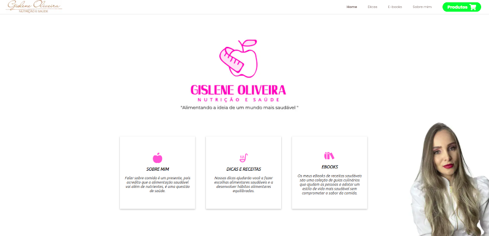
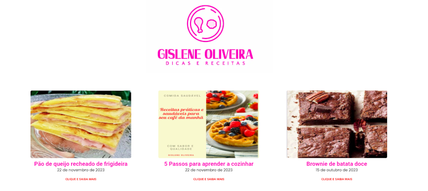

# healthy-life-nutrition

https://healthy-life-3x0qh2huz-guilhermegomesti1.vercel.app/

First, run the development server:

npm run dev 
or
yarn dev
Open http://localhost:3000 with your browser to see the result.

the API is fetched from the link https://vidasaudavel.cdn.prismic.io/api/v2. 

# Sobre o projeto

Este projeto tem como objetivo um site para vendas de ebooks e postagens de dicas e receitas, proporcionando uma plataforma moderna e atualizada, que ofereça uma experiência de navegação intuitiva e agradável. Utilizando as tecnologias mais atuais como HTML, SCSS, JS, TypeScript e NextJS, todas as funcionalidades do site foram desenvolvidas para atender às necessidades do cliente.

Foi implementado um Sistema de Gestão de Conteúdo para permitir que o cliente possa fazer postagens de ebooks e dicas de forma autônoma, trazendo maior agilidade e autonomia para o gerenciamento do conteúdo. Além disso, o site foi desenvolvido de forma responsiva e acessível em todos os dispositivos, garantindo a melhor experiência de navegação para o usuário.

O site foi entregue com sucesso ao cliente e está em pleno funcionamento. 

## Layout mobile
 

## Layout web

# Tecnologias utilizadas

## Front end
- HTML 
- SCSS 
- JS 
- TypeScript
- ReactJS

## Back end
- CSM- Prismic

# Autor

Guilherme Gomes

https://www.linkedin.com/in/guilherme-gomes-427321238/

