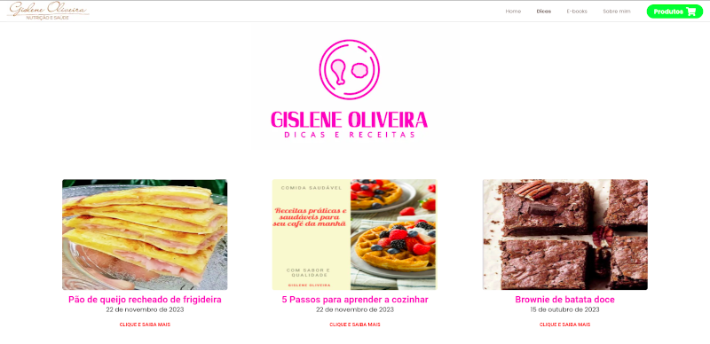

# Gislene Oliveira Nutricionista

# Sobre o projeto

https://healthy-life-3x0qh2huz-guilhermegomesti1.vercel.app/

Contexto: Desenvolvimento do site para vendas de ebooks e postagens de dicas e receitas do zero, utilizando tecnologias como HTML / CSS / JS / TypeScript e ReactJS.

Ação: Utilizei minhas habilidades em programação para construir todas as funcionalidades do site. Além disso, implementei um Sistema de Gestão de Conteúdo para que o cliente pudesse fazer as postagens dos ebooks e dicas de forma autônoma. 

Resultado: O site foi entregue com sucesso ao cliente e está em pleno funcionamento. Ele tem recebido ótimas avaliações dos usuários, além de gerar vendas constantes de ebooks e atrair muitos acessos pelas postagens de dicas e receitas. Além disso, o cliente ficou satisfeito com a facilidade de utilização do Sistema de Gestão de Conteúdo, o que permitiu que ele pudesse atualizar o conteúdo do site sem precisar de ajuda técnica. Vale ressaltar que o site ficou totalmente responsivo e acessível em todos os dispositivos.

## Layout mobile
 

## Layout web

# Tecnologias utilizadas
## Back end
- CSM- Prismic

## Front end
- HTML / CSS / JS / TypeScript
- ReactJS

# Autor

Guilherme Gomes

https://www.linkedin.com/in/guilherme-gomes-427321238/

